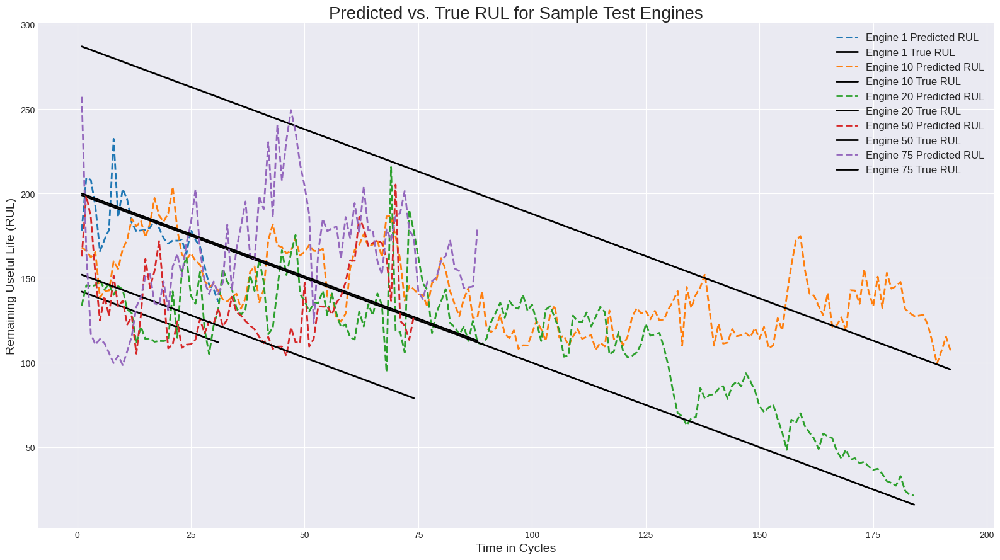

# Aircraft Turbofan Engine RUL Prediction

## Project Overview
This project implements a machine learning solution to predict the Remaining Useful Life (RUL) of aircraft turbofan engines using the NASA C-MAPSS dataset. The goal is to forecast engine failure based on sensor data, which can support predictive maintenance strategies in aerospace applications.

## Dataset
**NASA C-MAPSS (Commercial Modular Aero-Propulsion System Simulation) - FD001**
- **Training data**: 100 engines with complete operational history until failure
- **Test data**: 100 engines with partial operational history  
- **Features**: 21 sensor measurements and 3 operational settings per cycle
- **Total data points**: ~33,700 sensor readings across all engines

## Technical Approach

### Data Preprocessing
- Loaded space-separated text files and applied consistent column naming
- Removed constant-value features (operational settings and low-variance sensors)
- Calculated RUL for training data using linear countdown from max cycles to failure
- Reconstructed RUL for test data using provided ground truth values

### Feature Engineering
- **Rolling averages**: 10-cycle window to smooth sensor noise and capture trends
- **Rate of change**: Calculated sensor value differences between consecutive cycles
- Applied features to all sensor columns to capture degradation patterns

### Model Implementation
- **Algorithm**: Random Forest Regressor (100 estimators)
- **Preprocessing**: StandardScaler normalization
- **Training**: Fit on engineered features from training set
- **Validation**: Evaluated on separate test set

### Post-Processing
- Applied 5-cycle rolling average to predictions for trend visualization
- Generated both raw and smoothed prediction plots for analysis

## Results

### Model Performance
| Evaluation Method | RMSE | R² Score |
|-------------------|------|----------|
| Full test set | 49.81 cycles | 0.29 |
| Last cycle only | 34.25 cycles | 0.32 |

### Key Observations
- The model shows **moderate predictive capability** with R² of 0.29-0.32
- **Better performance at end-of-life**: RMSE improves to 34.25 cycles when evaluating only the final cycle of each engine
- Predictions capture general degradation trends but show variability in mid-life cycles
- Rolling average smoothing helps visualize overall trends despite prediction noise

### Visualizations
Two complementary plots demonstrate model behavior:
#### Raw Predictions - Model Responsiveness to Sensor Data

*Shows model responsiveness to cycle-to-cycle sensor fluctuations*
#### Smoothed Predictions - Trend Analysis  

*Rolling average applied to predictions highlights underlying degradation trends*

### Key Visual Insights:
- Model captures general degradation patterns across different engines
- Engine 20 shows particularly good prediction accuracy in later cycles
- Smoothing reveals clearer trends while maintaining prediction validity
- Raw predictions demonstrate model sensitivity to sensor variations

## Technical Skills Demonstrated
- **Data pipeline development**: End-to-end preprocessing of time-series sensor data
- **Feature engineering**: Created meaningful derived features from raw sensor readings  
- **Machine learning**: Applied regression algorithms to complex multi-variate time-series
- **Model evaluation**: Used appropriate metrics for regression performance assessment
- **Data visualization**: Created informative plots for model interpretation

## Implementation Details
- **Languages/Libraries**: Python, pandas, numpy, scikit-learn, matplotlib
- **Data handling**: Processed ~33K data points across multiple engines
- **Feature space**: Expanded from 21 raw sensors to 63 engineered features
- **Model training**: Utilized all available CPU cores for efficient Random Forest training

## Project Scope & Limitations
- **Academic dataset**: Results based on simulated NASA data, not real operational data
- **Single failure mode**: FD001 subset represents one specific failure scenario
- **Model complexity**: Random Forest chosen for baseline performance; deep learning approaches could potentially improve results
- **Evaluation context**: Performance should be assessed relative to operational requirements and safety margins

## Files Structure
```
├── train_FD001.txt    # Training dataset (NASA C-MAPSS)
├── test_FD001.txt     # Test dataset  
├── RUL_FD001.txt      # Ground truth RUL values
└── main.py            # Complete implementation
```

## How to Run
1. Download NASA C-MAPSS FD001 dataset files
2. Place all .txt files in the same directory as the Python script
3. Run the script to see training output, performance metrics, and visualizations
4. Two plots will be generated showing prediction results

## Learning Outcomes
This project provided hands-on experience with:
- Time-series data preprocessing and feature engineering
- Regression modeling for predictive maintenance applications
- Model evaluation techniques for engineering applications
- Balancing model complexity with interpretability
- Visualizing time-series predictions effectively

---

*Note: This is an educational/portfolio project using publicly available NASA simulation data. Results demonstrate technical competency in machine learning pipeline development and time-series analysis.*
